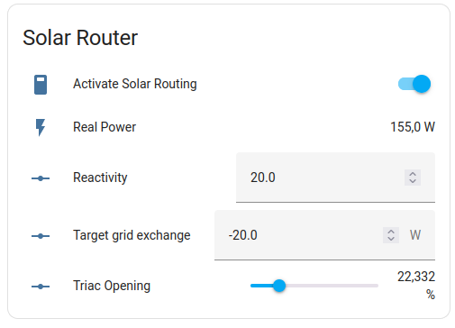

# Solar Router for ESPHome

**Solar Router for ESPHome** est un projet DIY visant à fournir un dispositif matériel spécialisé et un logiciel conçu pour optimiser l'utilisation de l'énergie solaire. Il effectue une surveillance en temps réel et une gestion intelligente de l'énergie excédentaire pour rediriger efficacement le surplus d'énergie solaire vers des charges désignées comme les chauffe-eau ou les systèmes de protection contre le gel.

Les principales caractéristiques comprennent un choix d'algorithmes de routage d'énergie dynamique (variable, ON/OFF), de sources de compteurs d'énergie (locales ou distantes ...), de régulateurs (avec triac ou relais ...), et une intégration transparente avec [HomeAssistant](http://home-assistant.io) via le firmware [ESPHome](http://esphome.io).

Ce composant permet aux utilisateurs de surveiller et de contrôler facilement les fonctionnalités du routeur au sein de l'écosystème *Home Assistant*, facilitant ainsi la gestion et l'automatisation de l'énergie.

!!! danger "Avis important"
    Ce projet implique de travailler avec de la haute tension (110 ou 230 volts), ce qui peut être dangereux.  
    Veuillez lire la [clause de non-responsabilité](disclamer.md) avant de mettre en oeuvre le projet **Solar Router for ESPHome**.

!!! tips "Capacités étendues avec les capteurs Home Assistant"

    **Solar Router for ESPHome** est nativement compatible avec certains compteurs d'énergie bien connus du marché (voir le chapitre *Power meter* dans le menu de gauche). Le ***power meter [Home Assistant](power_meter_home_assistant.md)*** étend la source de mesure à tous les capteurs de *Home Assistant*, le rendant compatible avec un grand nombre de compteurs d'énergie.

{width=350}
{width=350}
