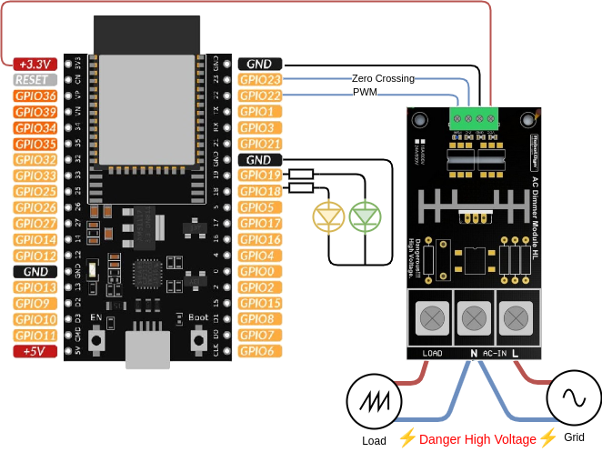
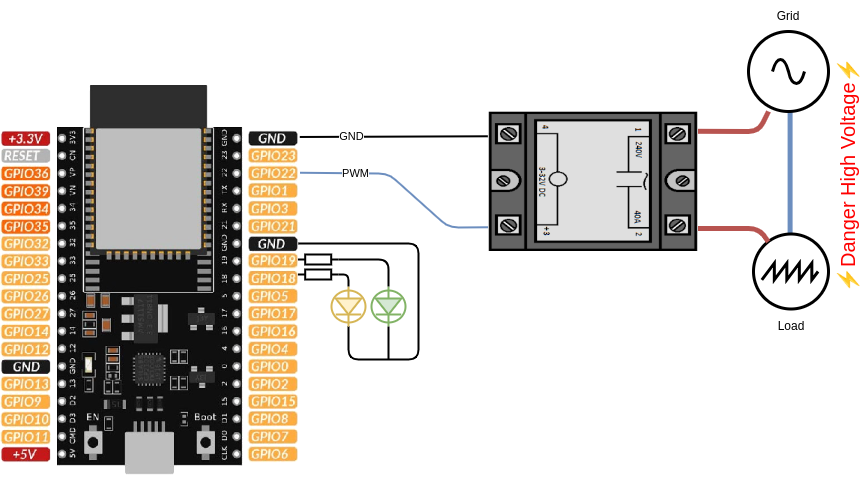
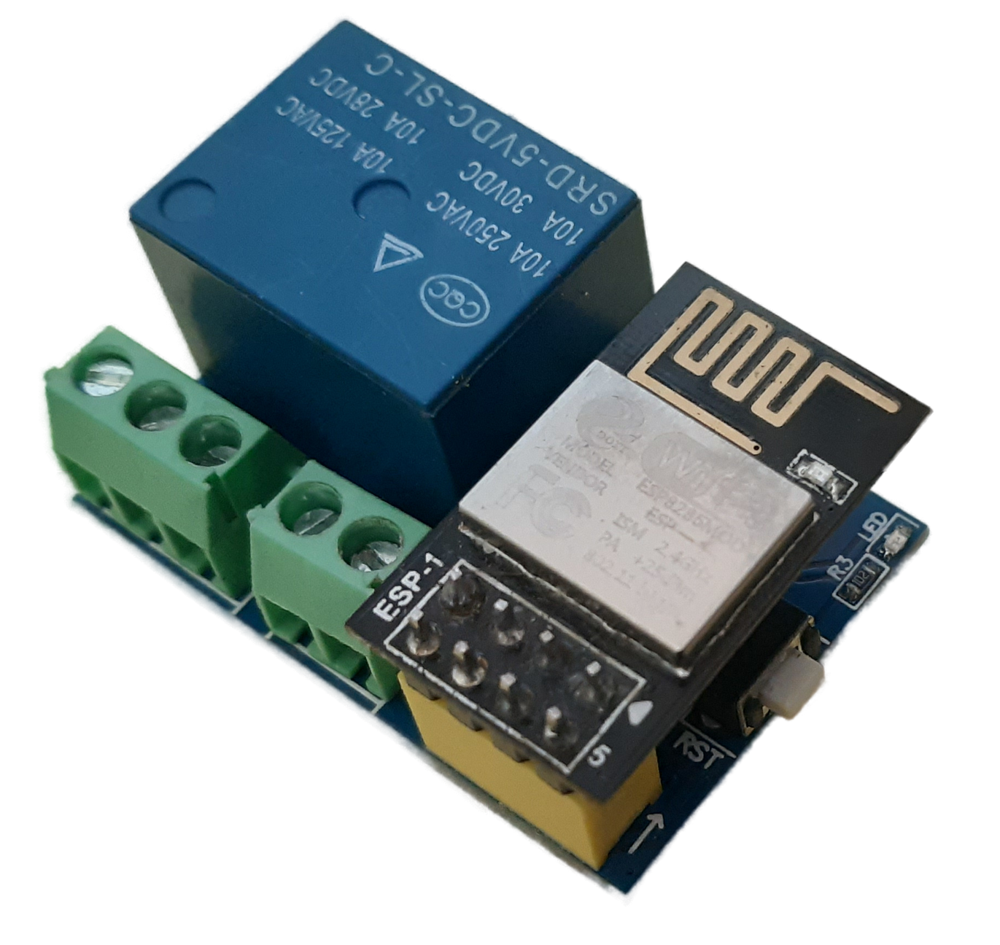

# Hardware

The hardware used for development is the one proposed by [F1ATB.fr](https://f1atb.fr/fr/routeur-photovoltaique-realisation-materielle/) .

On the photos bellow; as the heat dissipator provided by RobotDyn is under dimensionned, the triac has been unsoldered from the board and screwed into a big heat dissipator. Wires have been added to link the triac into the board.

A 12V power supply is used in addition with a buck converter to power the system. The 12V may be used to power a fan in an event of an over heating.

{ width=360 }
{ width=300 }

The router has been built to be connected to a frost protection system and then provide standard electricals sockets.

## Using a regulator base on a triac

Bill of material:

* 1 x ESP32-dev board (Wroom-32U with external antenna)
* 1 x Green LED
* 1 x Yellow LED
* 1 x Triac from RobotDyn 24A
* 2 x resistor 470 Ohms for LEDs

## Using a regulator base on a relay

Bill of material:

* 1 x ESP32-dev board (Wroom-32U with external antenna)
* 1 x Green LED
* 1 x Yellow LED
* 1 x Solid state relay
* 2 x resistor 470 Ohms for LEDs

## The smallest Solar Router

{ width=200 }

Bill of material:

* 1 x ESP01 relay module board
* 1 x ESP8266 (or equivalent)

!!! Note "This router has some limitation"
    * It has to be used with ON/OFF engine and is not compatible with variable engine
    * Due to the small space of memory, it doesn't support OTA