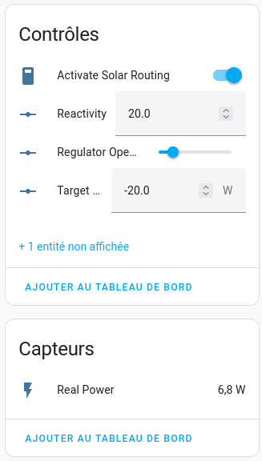

# Solar router

**Solar Router for [ESPHome](http://esphome.io)** has been designed to work with [Home Assistant](http://home-assistant.io) and it requires the installation of [ESPHome integration](https://www.home-assistant.io/integrations/esphome/).  

{ align=left }
!!! note ""
    **Controls**
    
    * ***Activate Solar Routing***  
      Control if Solar routing should be activated or not
    * ***Reactivity***  
      How fast will be the solar routing 
    * ***Regulator opening***  
      What is the current percentage of gate opening to send energy to the load 
    * ***Target grid exchange***  
      What is the target of energy exchanged with the grid.  
      &lt; 0 energy is sent to the grid  
      &gt; 0 energy is used from the grid
!!! note ""
    **Sensors**
    
    * ***Real Power***  
      Energy actually exchanged with the grid. Updated every secondes. 

 
 
 

When solar routing is deactivated, triac opening slider can be modified "by hand". 

!!! note 
    If you modify the triac opening state while the solar routing is enabled, the routing algorithm will immediately modify the value to meet target grid exchange level.